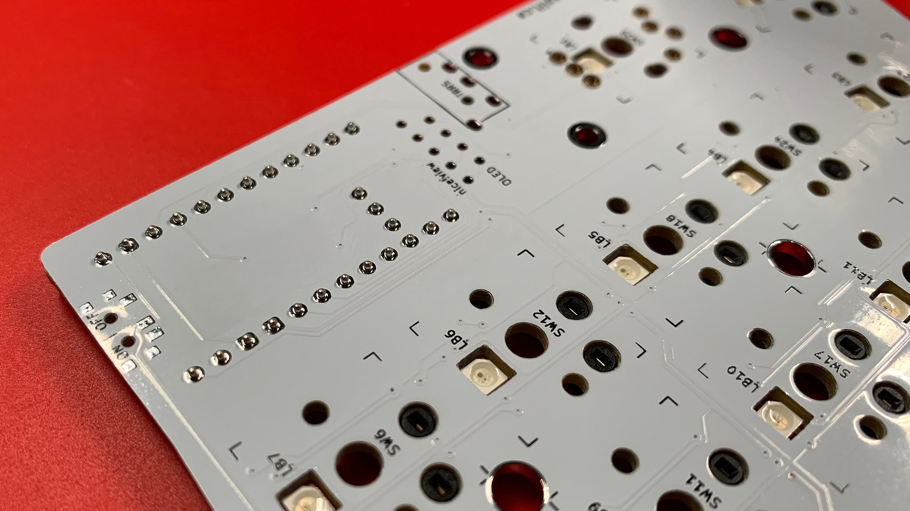
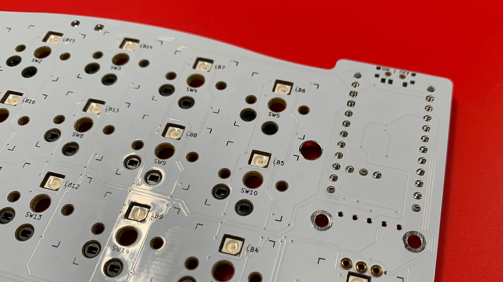
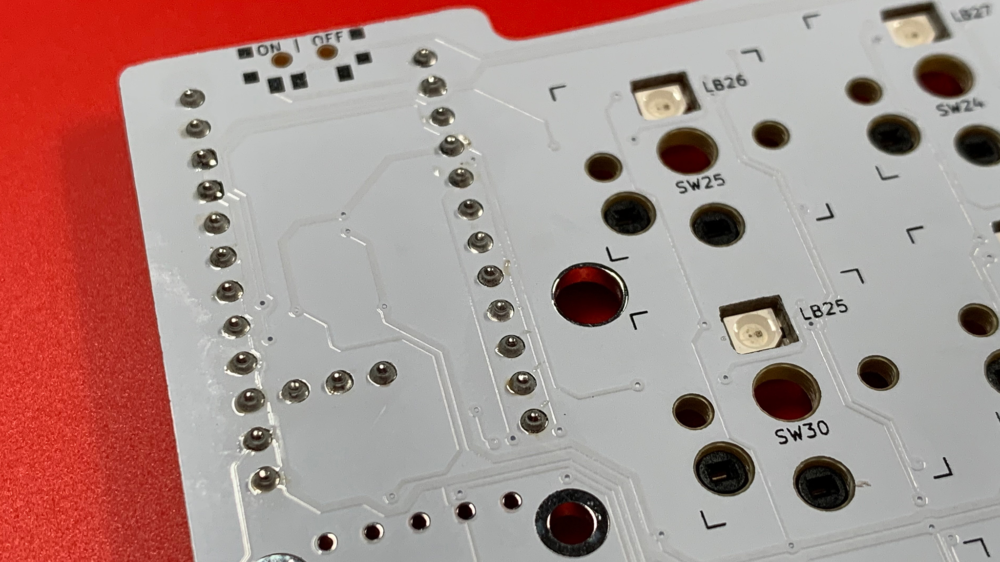
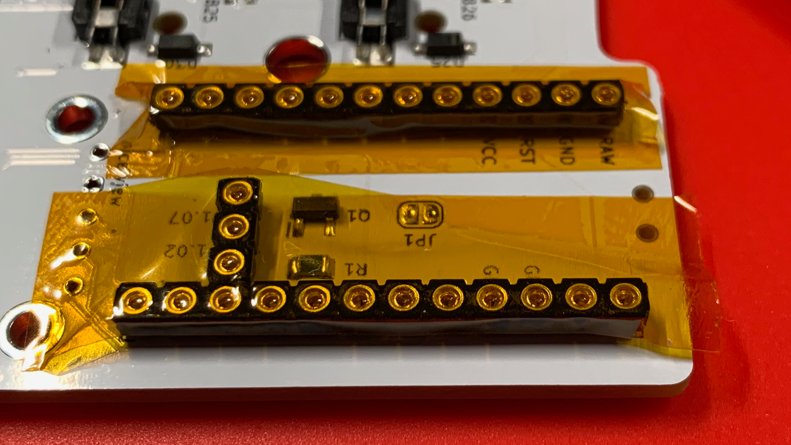
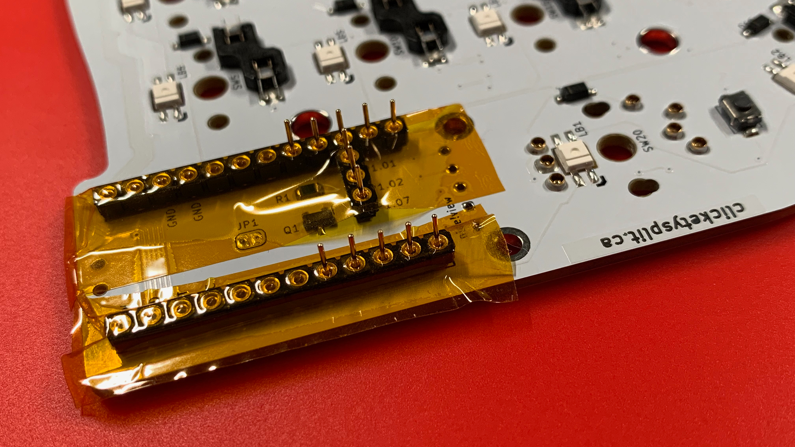
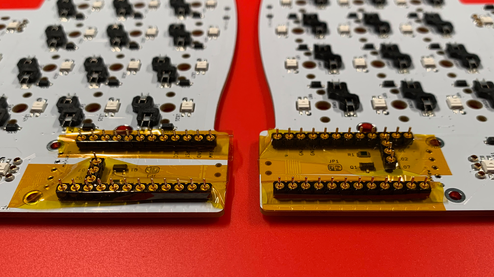
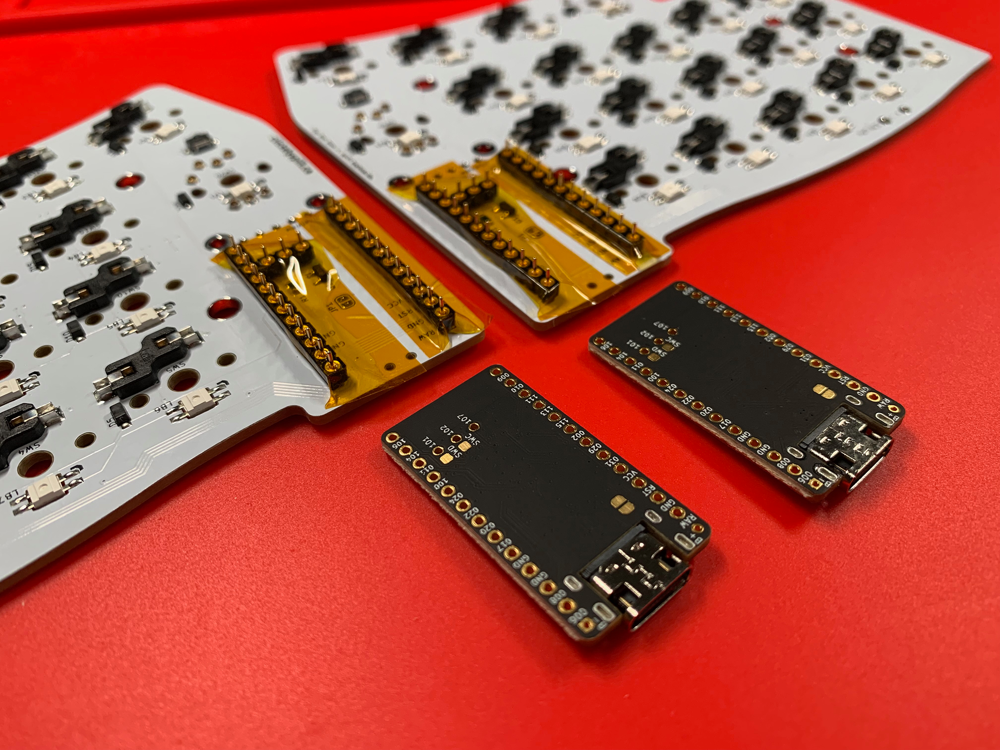
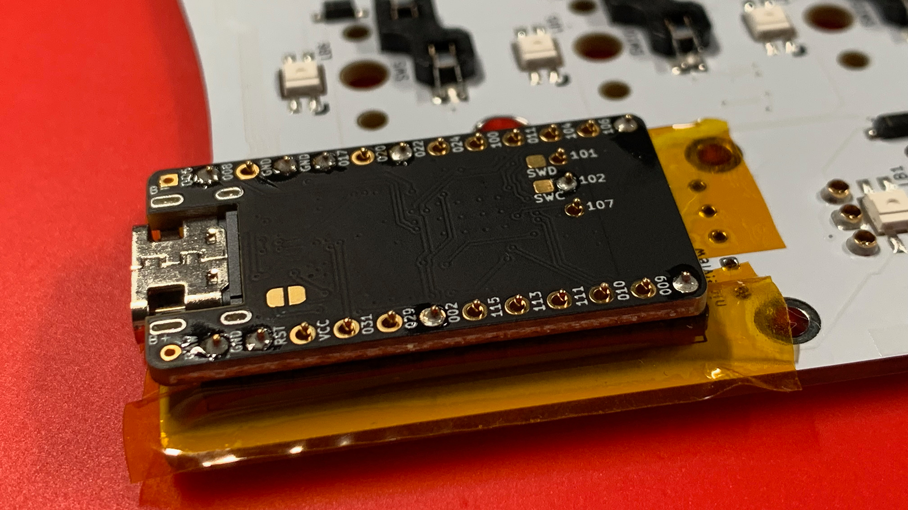
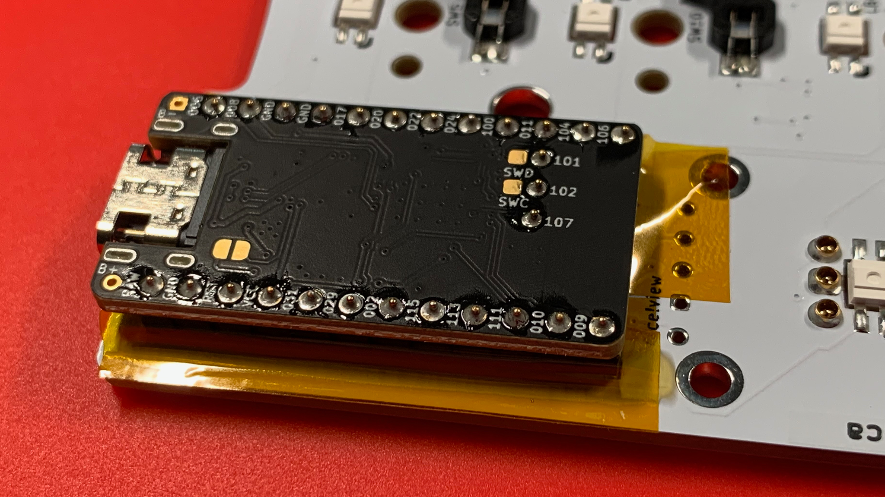
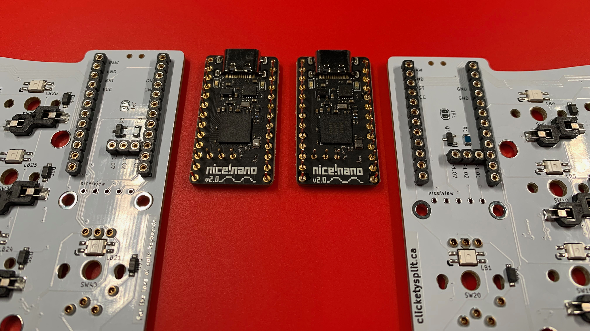

# Preparing the Microcontrollers (MCUs)
In the chapter: [Prepare Firmware](3-Prepare-Firmware.md), it was recommended to consider flashing your microcontrollers so that you knew that your build environment and firmware are in good shape.  If you have not done so, it may be a good opportunity to do so now.

## MCU SIP Sockets
When soldering the MCU Sockets, they are inserted from the bottom of the PCB, and soldered from the top.

> **WIRELESS IMPLEMENTATIONS** \
> If your implementation leverages nice!nanos, you will have a pair of Mill-Max 3-position sockets.  These should also be soldered if you choose to install RGB LEDs, MOSFETs, and Resistors.

The simplest way to install the sockets is to insert the two 12-position sockets, and the optional 3-position socket; place a piece of card stock over top of the sockets, so you can flip the PCB over without losing the socket positions.

Pull or slide the card stock from under the components and the sockets will be ready for soldering.

In order to solder the sockets into position, consider the following:

1. Prepare the soldering iron to 325℃.
2. While holding a wick of solder, place your ring finger in the centre of the two 12-position sockets and press down firmly.  Doing so, will ensure that all the sockets are perpendicular to the PCB.
3. Solder position 1 and 12 of each 12-position socket.
4. Optionally, solder position 2 of the 3-position socket.

    ***Note:*** This should provide you the opportunity to lift the PCB and ensure that the sockets are indeed perpendicular to the PCB.

    If any of the sockets do not look perpendicular, use the soldering iron to warm up one of the soldered positions and straighten up the socket accordingly.

5. Once each socket has been verified, go through the process of completing the remaining socket legs.

    Consider working from the middle towards each end so that there is no chance that the header will bow.  Keeping your ring finger depressed in the centre of the socket headers will help ensure the headers are even and perpendicular.

6. Clean the socket legs with 99% IPA and a cotton swab to keep your PCBs clean.

## MCU Pins
In preparation of soldering the MCU Pins, you may wish to collect the following items:

* Small pliers
* Kapton Tape, 10mm wide
* Hobby knife with a very sharp point.
* Scissors

Begin the process of pinning by placing a strip of Kapton tape over the socket holes.  Try to tape the holes as clean and as flat to the surface as possible.  This will ensure that when the microcontroller is in place, it will be as level and as flat as possible to the sockets themselves.

Once the Kapton tape has been placed, use the sharpest point of the hobby knife to poke pilot holes into the centre of each socket position.  The reason for the pilot holes is to reduce the "puckering" of the tape when the pins are inserted into each socket location.

> **NOTE** \
> Plunge the knife—just enough—to make the smallest of holes.  The pilot hole needs to be small so that when the pin is inserted, it has a seal around it so that solder does not seep through.

With the pilot holes prepared, begin placing a pin into each socket location.  Use the pliers to grasp a pin—at least half of the pin in the jaws—and insert straight into the socket.

You will feel the pin go through the tape, and then you will feel resistence from the socket...push through, but not too aggressively.  The pin will sink through and eventually stop.  You are at the proper depth if approximately 2.30mm to 2.33mm extrudes.

Continue until all pins have been inserted.  When complete, have a look at all the pins—at eye level—and see if they are all at the same height.  If any look "too" much higher than the rest, or seem to be outside of the 2.30mm to 3.33mm threshold, try seating the pin again.

You are now ready to solder in the microcontrollers.

## MCU Installation
Now that the hard work is done...soldering the sockets and seating the pins...it's time to solder the pins to the microcontroller.

Before soldering, have a look at the PCBs, and have a look at the microcontrollers.  You should notice some socket locations on the PCB correspond to the through hole locations on the microcontroller—match these up.

You'll notice that the ***component side*** of the microcontroller faces towards the PCB.

With the microcontroller in place, you may begin soldering.  I recommend soldering positions 1 and 12 on each side of the microcontroller, so that the microcontroller has been anchored.

Once this has been done, work your way from the centre of the microcontroller towards the outside—pressing your ring finger in the centre of the microcontroller to ensure it does not move, nor bow as each location is soldered in place.

> Take a moment to clean each location with 99% IPA and a cotton swab.

## Removal of MCU
I'll be blunt...removal of the microcontroller is not easy.  It takes light hands and patience.

With your index finger, begin lifting the microcontroller from the oppsite side of the USB-C port.  You want to see a millimeter or so of separation from the sockets.

Move over to the USB-C port side, and use the shoulders of the microcontroller's PCB to lift each side—lift as much as the opposite side you just lifted.

Repeat this process until the microcontroller becomes free.

> **IMPORTANT** \
> ***DO NOT*** be too aggressive because it is possible to bend the pins.  Take your time, and take it a millimeter at a time.

Once your microcontroller is out, have a look at all the pins at eye level and ensure each one is straight.

## Chapters
Next: [Chapter 11: Displays](11-Displays.md) \
Previous: [Chapter 9: Bypass Jumper](9-Bypass-Jumper.md) \
Chapters: [Table of Contents](README.md) \
Home: [Index](/README.md)
