# Displays: nice!view or OLED
In preparation of soldering the Display Pins, you may wish to collect the following items:

* Small pliers
* Small Clippers
* Kapton Tape, 10mm wide
* Hobby knife with a very sharp point.
* Scissors
* Calipers

## Pins
Installation of the pins are different than most implementations.  The pins are soldered to the PCBs and the Sockets are soldered to the Displays.

### Place the Pins into the Sockets
Place the sockets into corresponding through-holes (nice!view, or OLED through-holes on the PCB) that are designated for the pins.  The socket should fit snugly.  Essentially, you are using the PCB as a foundation to insert the pins.

With pliers, grasp a pin—about half of the length—and place it into the socket.  Insert the pin until it stops.  You may need to use firm pressure to pass the pin through to the base of the socket.

Repeat until all 4 or 5 pins have been inserted—depending on if you are using OLED, or nice!view displays.  Prepare both the left and right pins/socket pairing.

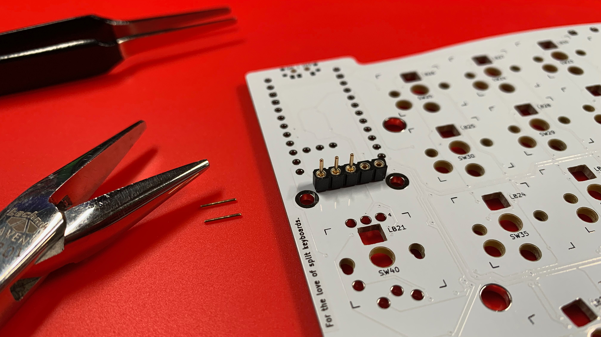

Once you have finished inserting the pins into the sockets, pull the pairing out, in order to prepare the through-holes for the pins.

### Soldering the Pins
Place a piece of Kapton tape over top of the Pins area of the PCB—the top of the PCB itself because the pins are soldered from the bottom.

With a hobby knife, create pilot holes so that the pins will pass through without buckling the tape.  The Kapton tape helps prevent solder from seeping through to the socket during installation.

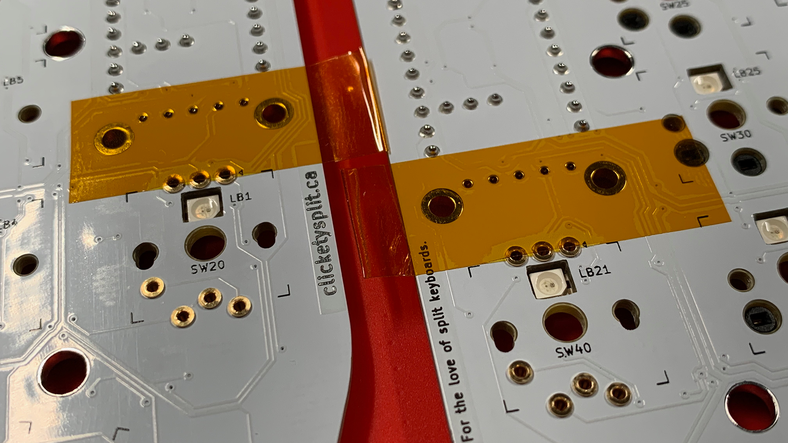

With the pilot holes prepared, place the pins/socket pair—**gold pins first**—into the PCB.

On the bottom of the PCB, clip off the **gold pin** extrusions, with a pair of flush cutters, to keep soldering clean.

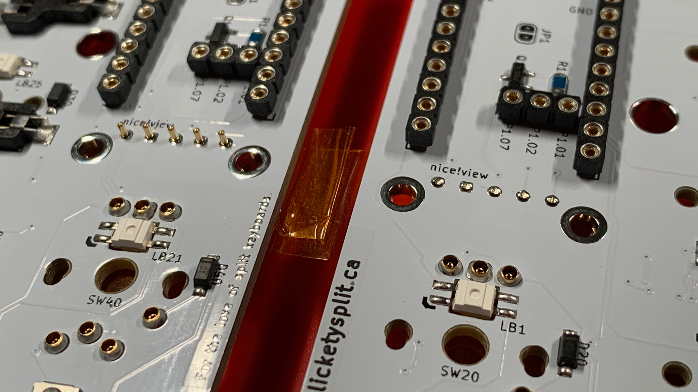

On the top side of the PCB, place a piece of Kapton tape overtop of the socket.  This will help keep the socket and pins in position and perpendicular to the PCB while soldering.

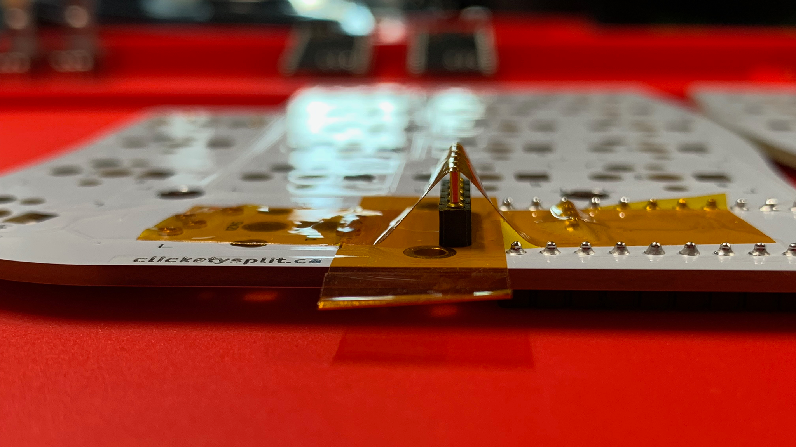

Solder the pin locations.

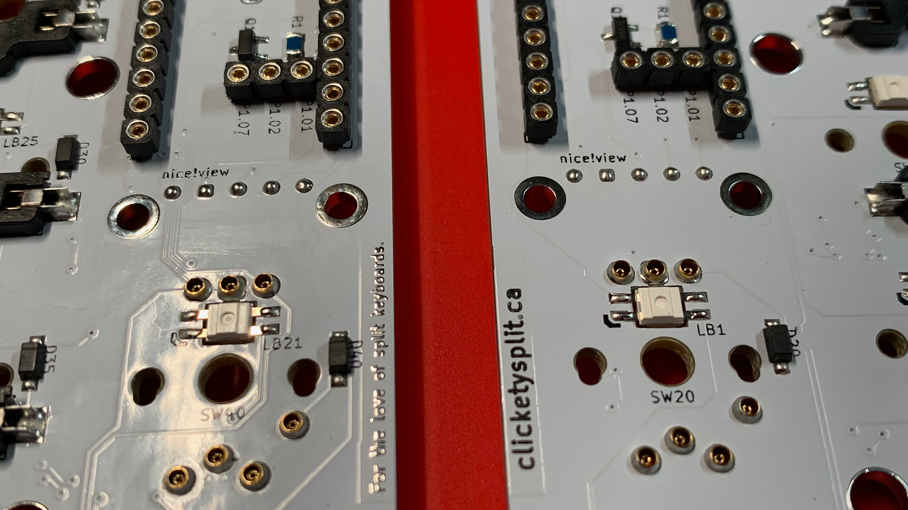

With the pins soldered in place, remove the Kapton tape, and pull off the socket.  It may require some pressure; try pinching off the socket.  With the socket off, remove the protective layer of Kapton tape.

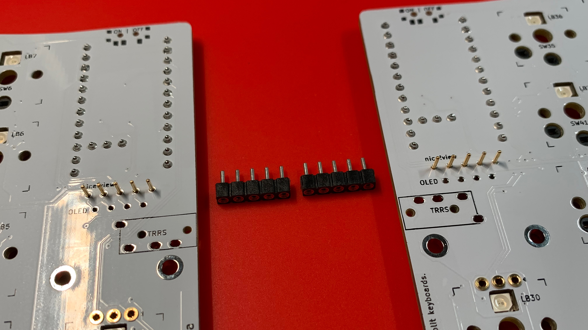

> Take a moment to clean each location with 99% IPA and a cotton swab.

> **NOTE** \
> Also clean the pins because they will pick up some of the adhesive of the Kapton tape.

## Fitting the Socket to the Case
The main reason for pinning the PCB and socketing the display is to provide better alignment, and more strength.

By hand fitting the socket to the case's display port, we can leverage the surface tension of the case and the socket to hold the display in place.

If you have ordered displays with your Leeloo or Leeloo-Micro kit, Clickety Split has already fitted the sockets to your case.

If you have added displays as an option, you may need to fit the sockets to the case's display port.

Use a small file, or emery board to carefully file each of the socket ends (the plastic housing of pin 1 and pin 4/5) so that the width is appropriate.

If required, carefully file the port opening so that it can accommodate the length and width of the socket itself.

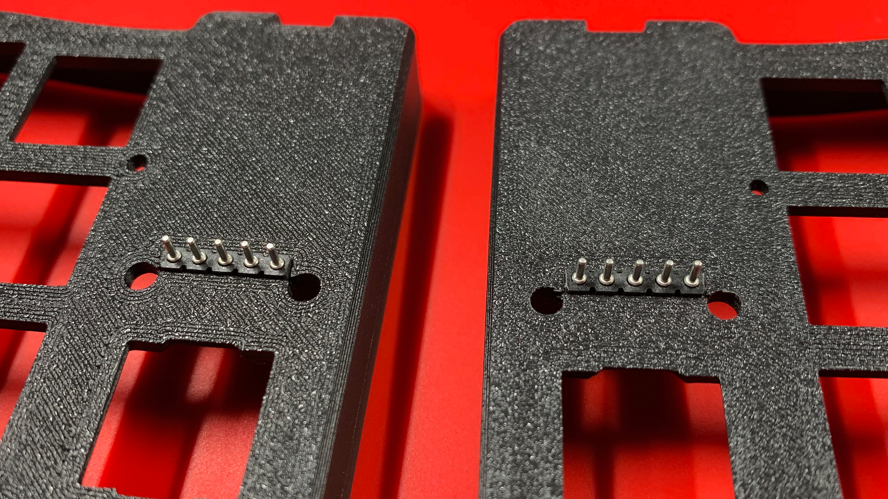

The fit should be snug—the socket should not just slip through.

> **NOTE** \
> Take note of the socket/half pairing and orientation that the socket has been fit to the port itself.

## SIP Sockets
As alluded to in the Pins section, installation of the sockets are different than most implementations.  **The sockets are soldered to the Displays.**

### Prepare the Sockets
Similar to soldering the display's pins to the PCB, we will clip off the header extrusions to ensure a clean solder joint.

To prepare the socket legs, insert the socket legs from the top of the display's PCB, and clip the extrusions as close as possible from under the display's PCB.

Clipping from the bottom will ensure that no damage is made to the top of the PCB, or what's worse, the display glass itself.

> **NOTE** \
> The following picture illustrates what the socket looks like after the clipping activity.

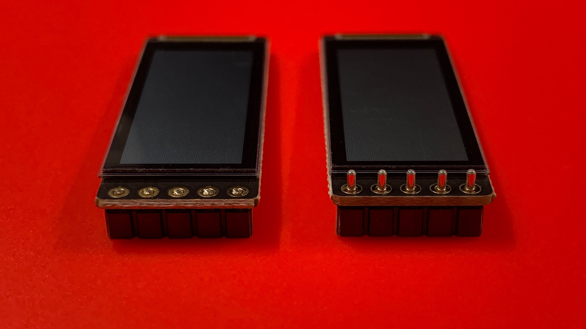

> **FINISHING TIP** \
> Use a small file, or emery board to ensure each leg is the same length.  File across all legs at the same time—**do not file with the display attached to the socket.**

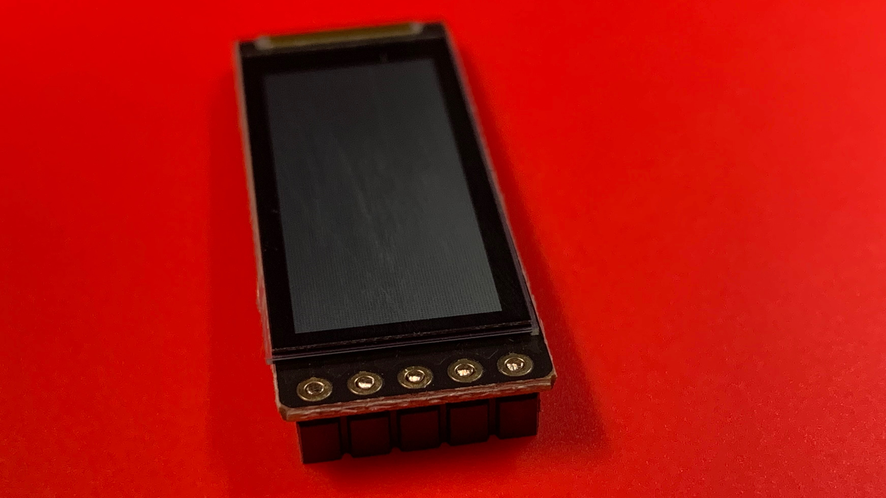

### Prepare the PCB and Case
Similar to ensuring the Reset Switches were soldered precisely.  Insert the PCB into its proper case and place switches in each of the 4 corners.  This will ensure that the PCB is square into the case itself.

Place the base of the case in position to support the PCB while working.

Insert the fitted socket into the case's display port and ensure the socket has been inserted evenly and completely.

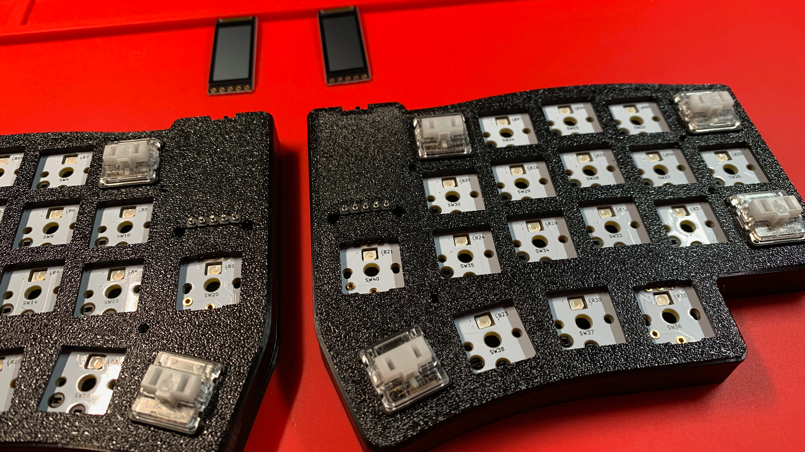

### Solder the Display
In order to solder the display into position, consider the following steps:

1. Place the display overtop of the socket.
2. With light and even pressure of your ring finger, hold the display in place.
3. Solder the first position.
4. Measure the distance of the bottom edge and the top edge of the display to the corresponding edge of the case.  Try to ensure the display is as parallel as possible to the case's edge.
5. Solder the last position of the display, and ensure that the display is still parellel to the case's edge.  If the display has shifted, hold the soldering iron overtop of one of the soldered joints, and adjust as required.

6. Once the display is on properly, solder the remaining positions.
7. Slowly lift out the display.

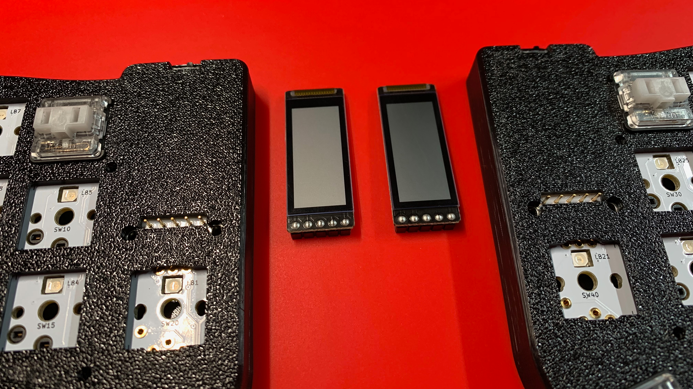

> Take a moment to clean each location with 99% IPA and a cotton swab.

## Chapters
Next: [Chapter 12: Reset Switches and TRRS Jacks](12-Reset-TRRS.md) \
Previous: [Chapter 10: Microcontrollers](10-Microcontrollers.md) \
Chapters: [Table of Contents](README.md) \
Home: [Index](/README.md)
