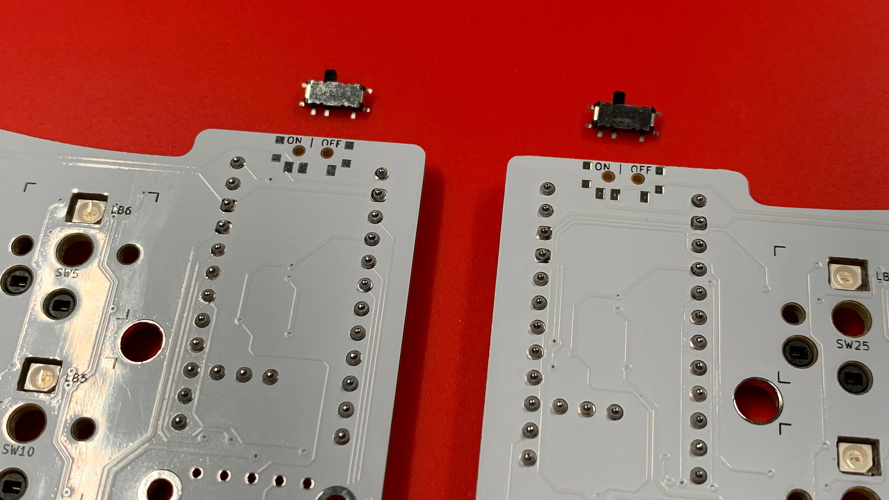
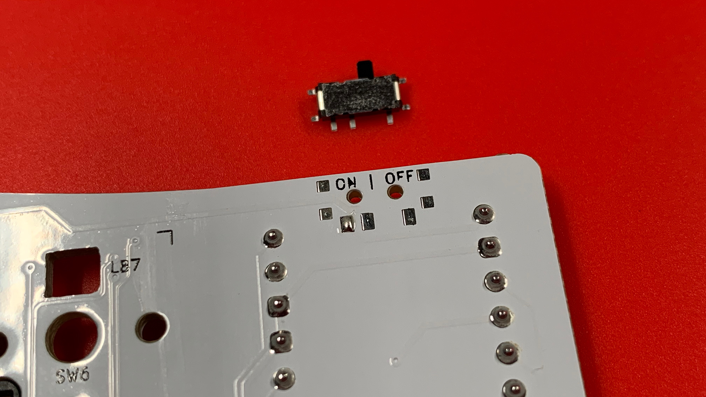
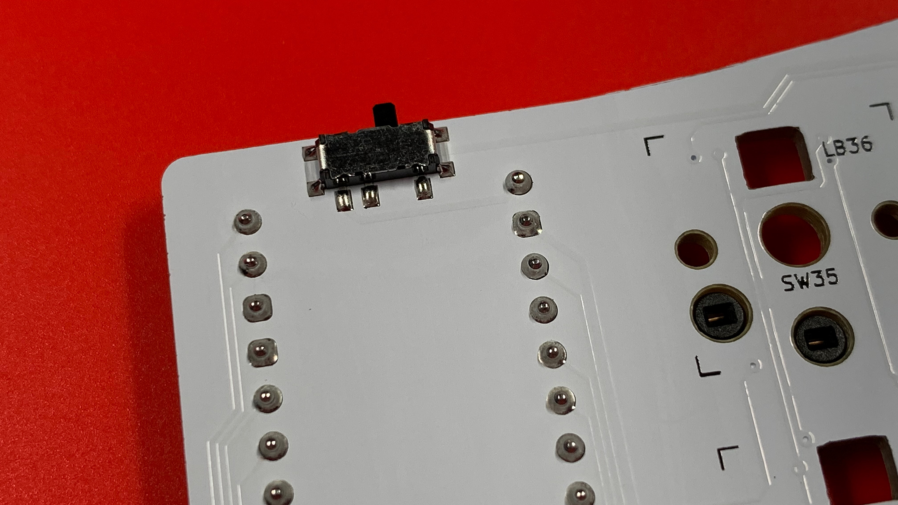

# On | Off Switches
> If your implementation is wired, and leverages the use of Elite-Pis, or Elite-Cs, you may skip this step.

Leeloo and Leeloo-Micro were designed to accommodate an Alps Micro Switch to cut power from the LiPo battery to the MCU.  It helps when travelling because power is not continually drawn as the keyboard tries to connect with devices around it, or if any of the switches or rotary encoders are pressed or turned…sending a signal to wake up the MCU.

## Installation
Installation is much like a diode.  Tin one leg to tack the switch onto the PCB. A fine tipped soldering iron is recommended, because the surface mount legs of these switches are very small.

> **NOTE** \
> The power switches are in the **On position** when packaged from the factory.  I would recommend placing them in the **Off position** either before, or after they have been installed—toggled to the right.

 After tacking the power switch to the PCB, work your way around the remaining leads.

> Take a moment to clean each location with 99% IPA and a cotton swab.

## Chapters
Next: [Chapter 14: Batteries](14-Batteries.md) \
Previous: [Chapter 12: Reset Switches and TRRS Jacks](12-Reset-TRRS.md) \
Chapters: [Table of Contents](README.md) \
Home: [Index](/README.md)
