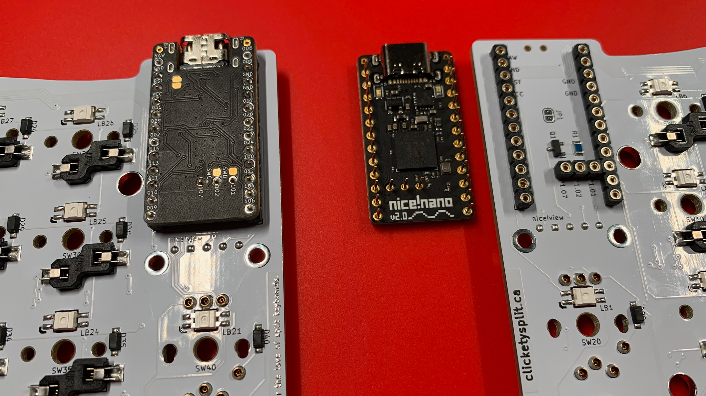
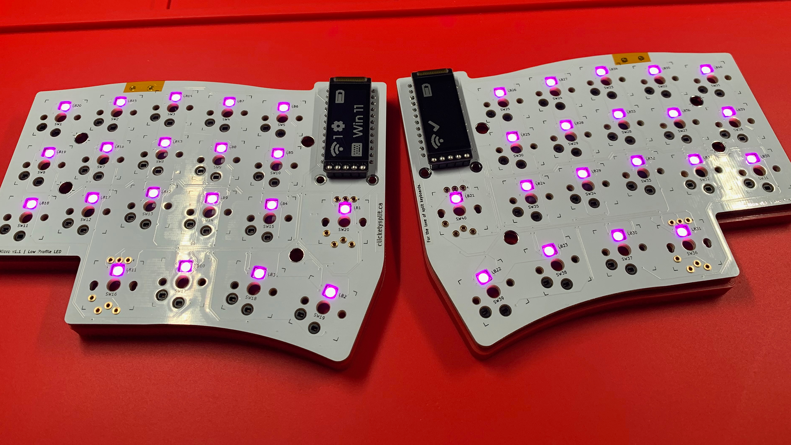

# Before Installation
A couple of recommended safety activities before inserting your microcontrollers back into their sockets.

### Test for RAW Power
First, test the RAW pin of the microcontroller's socket.

With help from a multimeter, select Voltage mode, and ensure that the DC feature has been enabled.

Place the Black lead from the multimeter to Ground, and the Red lead from the multimeter to the RAW pin's socket.

If the power switch is **Off**, you should not have a voltage reading.

If the power switch is **On**, you should see a voltage reading that corresponds to what was read in the previous chapter: ***Batteries***.

### Switch The Halves Off
Once the power switches and voltages have been tested; **turn off** each half and proceed with inserting the microcontrollers into their corresponding halves.

### Quality Assurance Test
If you have flashed each microcontroller with the RGB LEDs feature and/or the Displays feature, you may be able to do a quick test.

If you have configured displays: place your displays into position, being careful not to bend, nor hyperextend the display's socket over its associated pins.

Turn on the right half, and then the left half.  Depending on your configuration, the displays and/or the RGB LEDs should light up.

If all's good, you should see all the RGB LEDs light up, and status information on the displays.

If there are issues with the RGB LEDs, have a close look at the direction of each RGB LED and ensure each leg has a clean solder joint, and also ensure that the configuration setting for RGB LEDs has been activated.

If there are issues with the displays, ensure each pin and socket position has a clean solder joint, and also ensure that the configuration setting for displays has been activated.

## Chapters
Next: [Chapter 16: Switches and Encoders](16-Switches-Encoders.md) \
Previous: [Chapter 14: Batteries](14-Batteries.md) \
Chapters: [Table of Contents](README.md) \
Home: [Index](/README.md)
