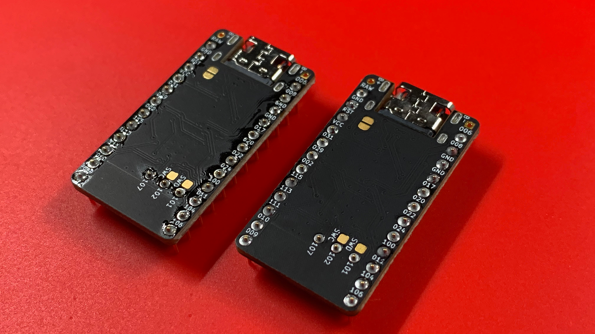

# Mise en place
Having my workspace organized and prepared gives me a sense of "ready."  Confidence that I have all the components I need to complete a particular project, or section of work.

Before you begin, consider organizing your workspace the way you like, and based on your preferences with the tools you have near by.

As a common approach to the build process, you may notice in the upcoming chapters, that I like to prepare all the components and align them in accordance to the location they will be soldered onto the PCB.  This helps reduce the risk of installing a particular component backwards or even upside-down.

Counting and aligning each component ensures you are not missing any, and that each component is not malformed, or broken.  It also keeps you moving smoothly.

## Cleaning the Shields
Not likely a required step, but I like to work with clean components.  I use a lint free cloth and dampen it with a little bit of 99% IPA.  With the damp cloth, I gently wipe the complete surface of the left/right front/back of the shields.  It helps remove any manufacturing residue, fingerprints, and oil that may have been transferred from manufacturing.

## Out, damned spot! Out, I Say! ~Lady Macbeth
Carry this tip with you like a feather of knowledge in your cap.  Once you have completed soldering a particular series of components, pour a tiny bit of 99% IPA into a ramekin, and use a cotton swab to lightly clean off the rosin that is left behind after soldering.

As you can see, the left side has a glossy residue, whereas the right has been cleaned.

Albeit, it will take some time...put on some music, play one of your favourite movies...Leeloo will love you for it.  You'll type faster too...I promise! ;)

## Chapters
Next: [Chapter 5: Receptacles](5-Receptacles.md) \
Previous: [Chapter 3: Prepare Firmware](3-Prepare-Firmware.md) \
Chapters: [Table of Contents](README.md) \
Home: [Index](/README.md)
