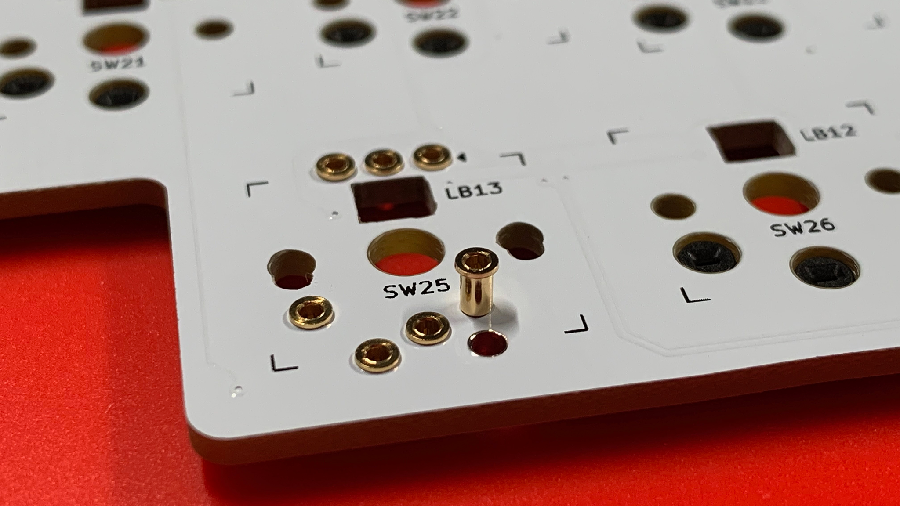
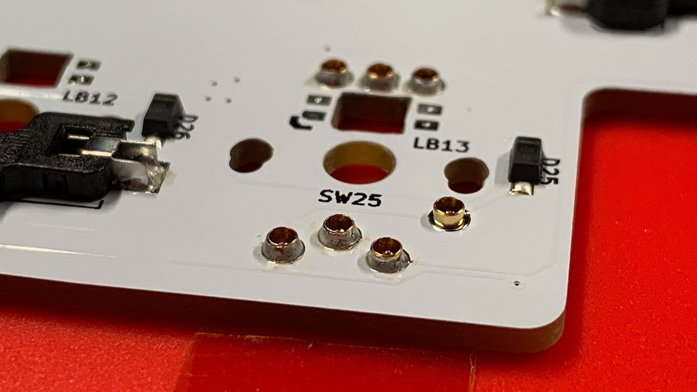

# Receptacles
In preparation of soldering the Mill-Max Receptacles, you may wish to collect the following items:

* Kapton Tape, 10mm wide
* Scissors

Before you begin, take a brief moment to study the receptacle through-holes of the PCBs; in particular:

**Leeloo**
* Switch 25
* Switch 29
* Switch 54
* Switch 58

**Leeloo-Micro**
* Switch 16
* Switch 20
* Switch 36
* Switch 40

You may notice that the top side of the PCB does not have a solderable perimeter; whereas the bottom of the PCB does.

This is because the receptacles are installed from ***the top of the PCB*** and soldered from the bottom.

With this knowledge, begin inserting the receptacles from the top of the board and seat them so they are flush with the PCB.  Because of the tolerance that the through-holes were designed, you may need to push in the receptacles with a bit of force.

It will feel like a press fit insert.  Enough force that you need to lean into it, but not too much that you will break, squash, or crush the component—Hulk Smash!

Mostly, the receptacles should slide in nicely.

With all the receptacles in place, use a strip of Kapton tape to keep them in position.  Try to press the tape in and around each of the receptacle so that there is no chance of the receptacle popping up or out.

Flip the board over, and you may begin soldering each location; consider the following:

* Use a fine soldering tip.
* Prepare the soldering iron to 325℃.
* Warm up the receptacle and the through hole at the same time by sharing the soldering tip with pad and the receptacle.
* Feed in a little bit—literally no more than about 1mm to 2mm—of solder.  The solder will make its way around the receptacle.
* Try not to place any downward force on the receptacle while the soldering; it will reduce the chance of moving or pushing the receptacle out of position.

Once all the locations have been soldered, you may peel off the Kapton tape, and examine your work.  Take a close look, at eye level, and ensure there is no gap between the shoulder of each of the receptacles and the PCB.

> Take a moment to clean each location with 99% IPA and a cotton swab.

## Chapters
Next: [Chapter 6: Diodes](6-Diodes.md) \
Previous: [Chapter 4: Mise en place](4-Mise-en-place.md) \
Chapters: [Table of Contents](README.md) \
Home: [Index](/README.md)
