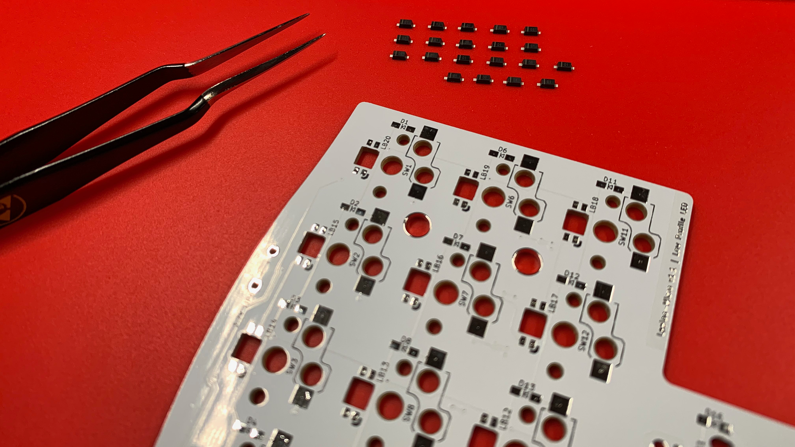
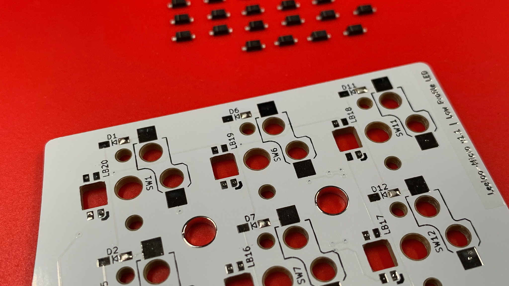
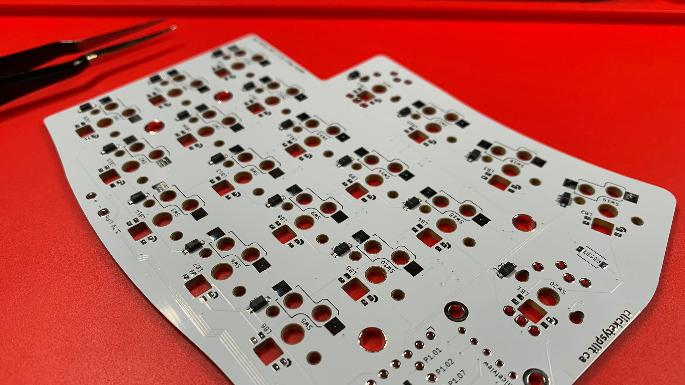
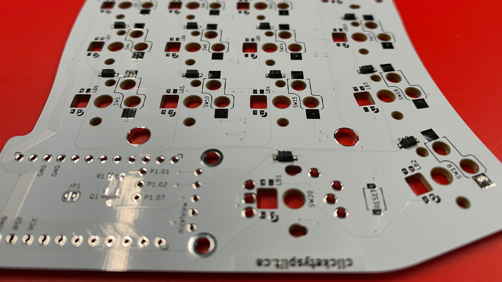

# Diodes
The surface mount pads of Leeloo are just large enough for SOD-123F diodes.  A fine tipped soldering iron will be required.

Why such small pads?  From my perspective, it helped keep the board’s design clean; not only saving space, but also while soldering the components—less solder.

Before soldering the diodes, consider unpackaging the diodes needed for the shield you are working with, and aligning them in the same direction as the shield’s diode direction.

You can identify the Cathode side of the diode by the white/grey bar that is laser enscribed on the one side of the diode itself.  And, on the PCB, the Cathod side is to the left of the Arrow—as indicated on by the silkscreen.

If you align the diodes in the same direction, it helps reduce the potential of soldering them the wrong way.

To prepare for soldering, consider tinning either the cathode or anode side of the diodes' surface mount pads, but not both.  I like to tin the anode side, and finish with the cathode side; spotting for the diode’s index stripe or mark upon completing each position.

Another benefit of consistent tinning of one side is: it helps ensure that as you pull from the row of aligned diodes you’ve created, you reduce the risk of installing one backwards.

After verifying that each diode is facing the proper direction, finish the installation by soldering the cathode pads.

> Take a moment to clean each location with 99% IPA and a cotton swab.

## Chapters
Next: [Chapter 7: RGB LEDs](7-RGB-LEDs.md) \
Previous: [Chapter 5: Receptacles](5-Receptacles.md) \
Chapters: [Table of Contents](README.md) \
Home: [Index](/README.md)
