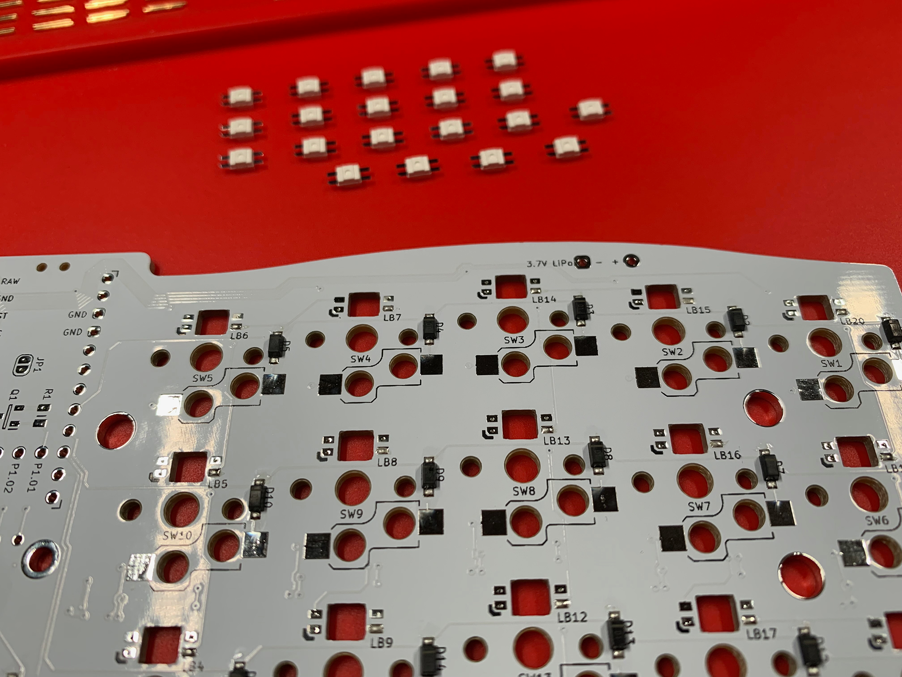
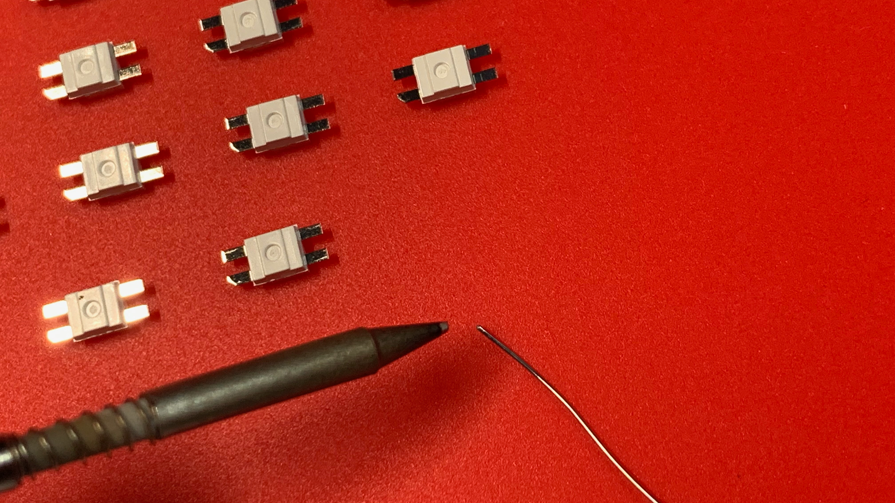
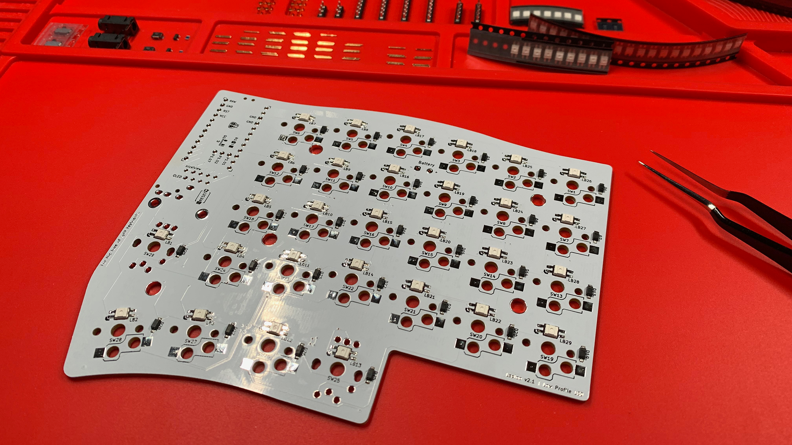
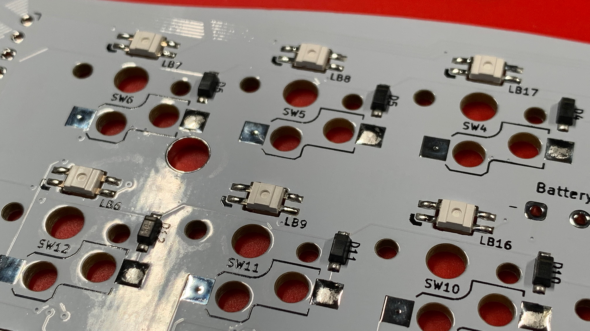

# RGB LEDs
Before installing the RGB LEDs, consider reading the **Bypass Jumper** chapter.

The [Bypass Jumper](9-Bypass-Jumper.md) chapter explains the difference between using the bypass jumper and the power cutoff MOSFETs and Resistors, and when to use each configuration.

## Wired with QMK
If you choose to implement with QMK and Elite-Cs or Elite-Pis, you **MUST** solder the Bypass Jumper; and, ignore installing the power cutoff MOSFETs and Resistors.

> **IMPORTANT** \
> If the Bypass Jumper is not bridged with solder, no power from the VCC pin will be channelled to the RGB LEDs.

## Wireless or wired with ZMK
If you choose to implement with ZMK and nice!nanos, you **MUST** solder the power cutoff MOSFETs and Resistors; and, ignore the bypass jumper.

At the same time, when installing the MCU Sockets, you **MUST** also solder the 3-position SIP Sockets.

## Soldering the RGB LEDs
Not unlike soldering diodes, RGB LEDs are no different.  Just twice as many legs!

If you take a close look at the PCB's RGB LEDs silkscreen.  You may notice that the Ground leg has an index mark.

When aligning the RGB LEDs themselves; place them face down, with the Ground Leg in the same direction as the PCB.

> **Side note**: A worn out fine solder tip and 0.3mm solder as compared to an RGB LED leg.

Select one SMD pad to tin—being consistent—at each RGB LED location.

Tack each RGB LED to its particular location, ensuring they are face down, and the ground leg is matched with the ground pad.

Once all RGB LEDs have been tacked, make your way around each leg, ending with the ground leg.  I like to end with the ground leg because it typically takes more time and heat to solder.

> Take a moment to clean each location with 99% IPA and a cotton swab.

## Chapters
Next: [Chapter 8: Hot Swaps](8-Hot-Swaps.md) \
Previous: [Chapter 6: Diodes](6-Diodes.md) \
Chapters: [Table of Contents](README.md) \
Home: [Index](/README.md)
