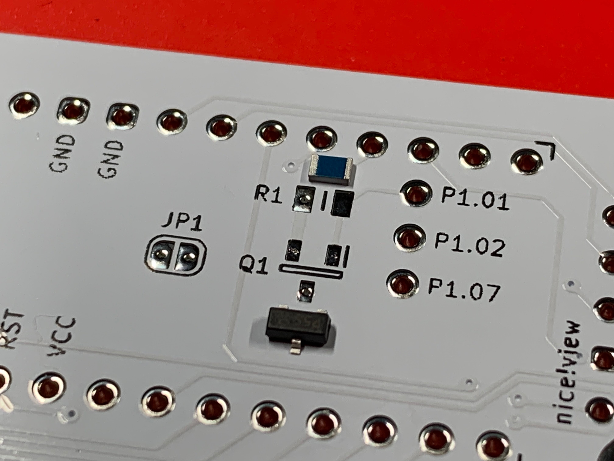
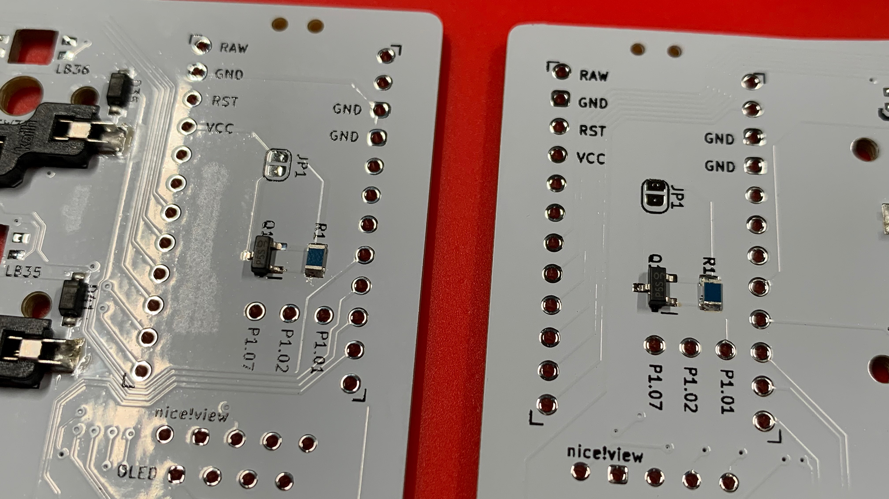
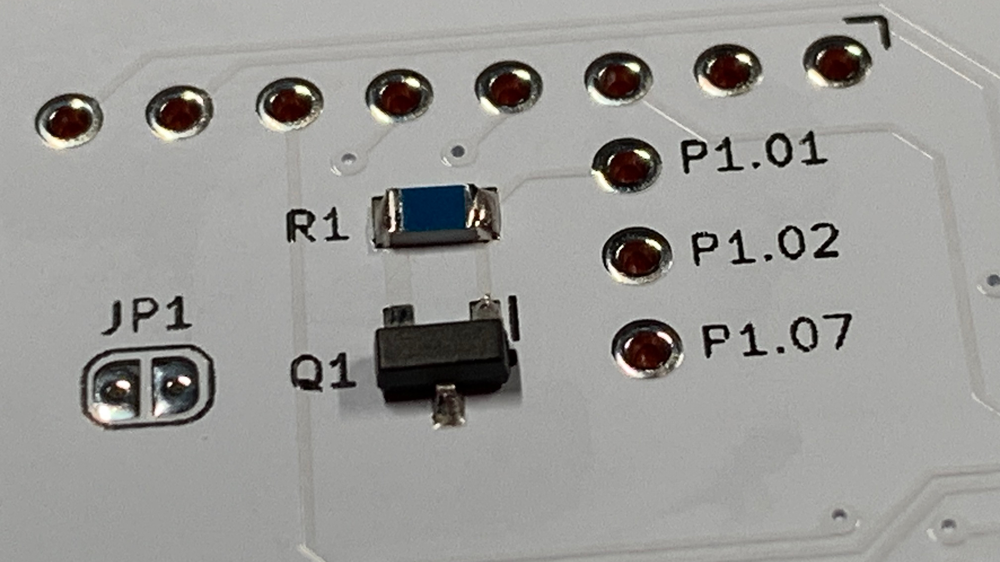

# Bypass Jumper
### Why use the Bypass Jumper?
The bypass jumper is used to—quite literally—bypass the circuitry added to cut power from the VCC pin to the RGB LEDs, by virtue of the, at present, experimental implementation of Power Domains.

If your implementation of Leeloo will be wired (i.e., use of Elite-C or Elite-Pi; and, QMK Firmware) and will also include RGB LEDs.  ***You must solder the bypass jumper—JP1 on the PCB.***

> **IMPORTANT** \
> If the Bypass Jumper **JP1** is not bridged with solder, no power from the VCC pin will be channelled to the RGB LEDs.

If your implementation of Leeloo, or Leeloo-Micro is wireless (i.e., use of nice!nano; and, ZMK Firmware) and will also include RGB LEDs:

* Ignore the JP1 bypass jumper.
* Install the MOSFETs and Resistors.
* Leverage the Power Domain branch, when compiling firmware, in order to make use of the feature—battery capacity is preserved while Leeloo or Leeloo-Micro is in sleep mode.

## Installation of the MOSFETs and Resistors
1. Tin one of the three SMD pads of the MOSFET location.
2. Tin one of the two SMD pads of the Resistor location.
3. Tack the MOSFET onto its position.
4. Tack the Resistor onto its position—the **blue** side is up; and [I like to] orient the wider of the two solderable ends towards the top of the board.
5. Complete soldering of the remaining SMD pads.
6. Clean each SMD pad with IPA and a cotton swab.

After tinning a particular leg of each component; tack the component itself to the PCB.

Make your way around and solder the remaining legs.

> Take a moment to clean each location with 99% IPA and a cotton swab.

## Chapters
Next: [Chapter 10: Microcontrollers](10-Microcontrollers.md) \
Previous: [Chapter 8: Hot Swaps](8-Hot-Swaps.md) \
Chapters: [Table of Contents](README.md) \
Home: [Index](/README.md)
