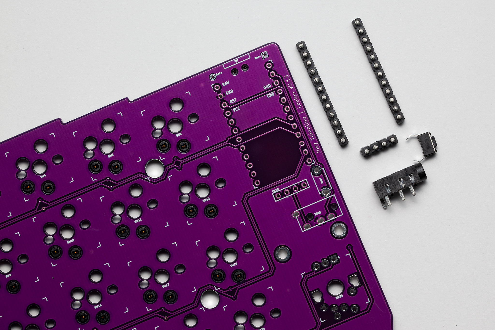
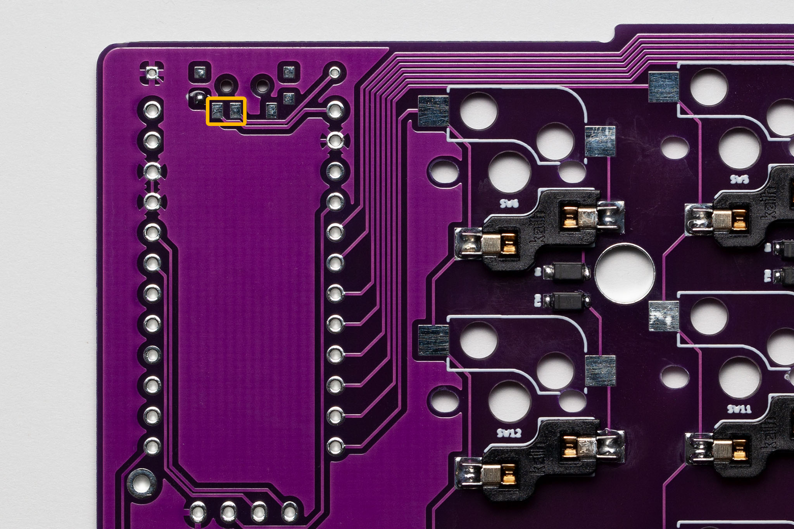
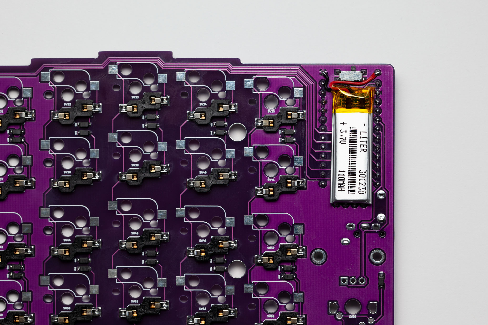
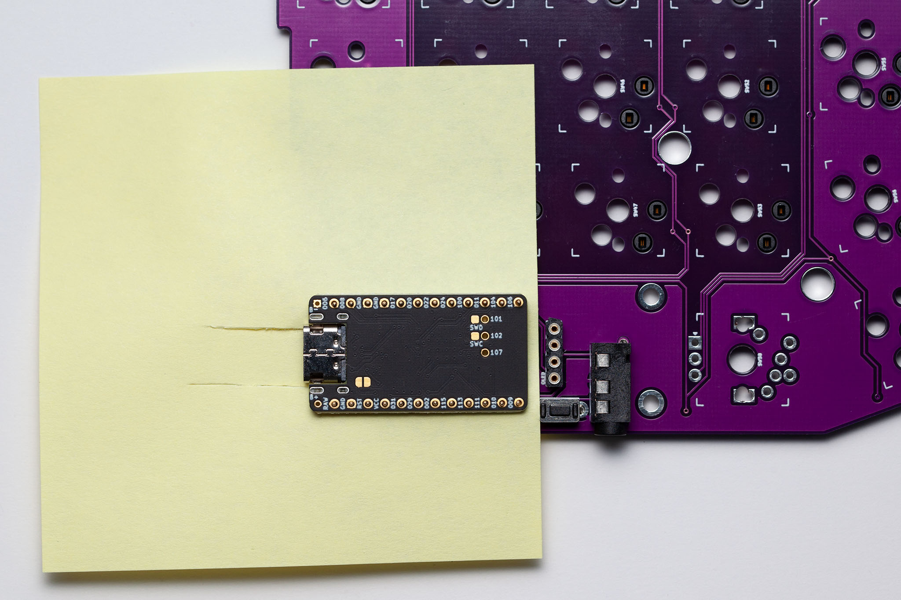
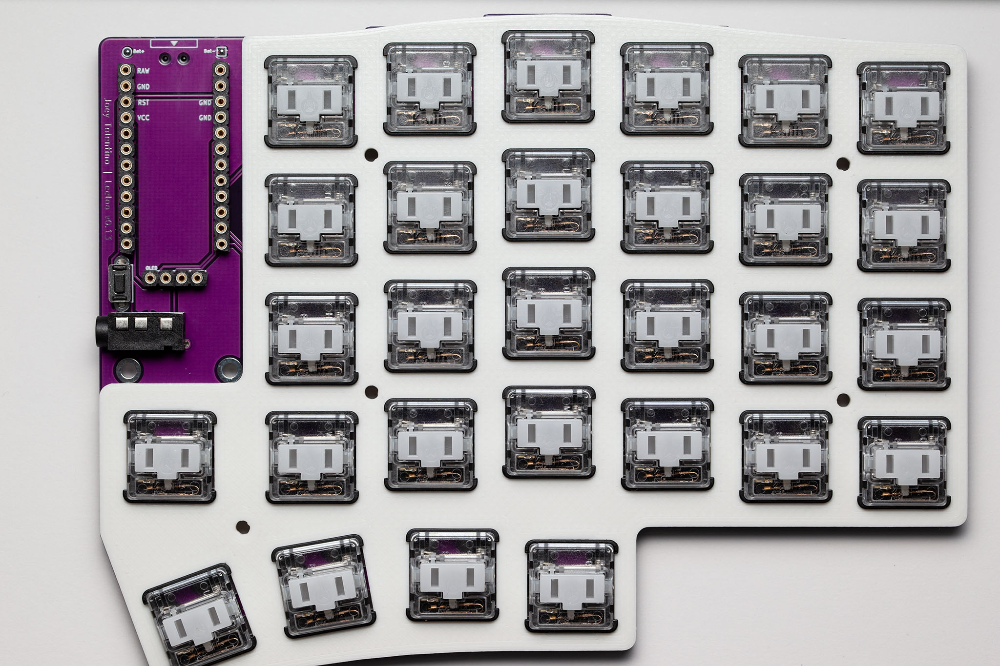

# Leeloo v1.0/v1.13 Build Guide

### Preamble
Leeloo is a 4x6x5m split keyboard designed and built from the ground up.  Leeloo’s design was inspired by the popular split keyboards Lily58, and Corne.  To learn more about the origins of Leeloo, please read the blog post [Leeloo | The Series’ Genesis](https://clicketysplit.ca/blogs/news/leeloo-the-series-genesis).

This guide has been written and organized based on my own experience.  I’ve been fortunate to have built boards like the Kyria, Sofle, Lily58, Corne, and Sweep.  Leeloo is no different.  There’s a natural progression you’ll realize if you’ve built similar keyboards, or have flipped through the various build guides of the aforementioned keyboards.

There are certain steps which help the build experience flow a little better, but as my Mom used to say, “there are hundreds of ways to peel an orange, what’s important is that you get to the fruit…enjoy it!”

Building your own keyboard should be fun, relaxing, and a neat sense of accomplishment.

If you have any questions, please, feel free to [contact me](https://clicketysplit.ca/pages/contact-us).  I’d be happy to share further insight, or workarounds that may not be mentioned in this guide.

### Safety Equipment
* Eye Protection
* Exhaust Fan
* Clean Workspace

First thing's first—Safety!  Because you're dealing with small items, and you're also working with a hot soldering wand; wear your safety glasses at all times; it will protect your eyes from heat, clippings, and they will also protect you from rosin that often splatters when it gets up to temperature.

Iimplement an exhaust fan or ensure a well ventilated area; if you can smell what you're soldering, your area is not ventilated enough.

Part of your safety is ensuring a clean workspace.  To borrow a phrase from the French culinary industry: Mise en place, which means "putting in place" or to "gather" having your workspace organized, and free from clutter will help prevent any at reach accidents.  The last thing you need is to bump your soldering iron off of its stand or holder, or even spill your 99% IPA while you're cleaning your soldering positions.

### Preparing for the Build Process
Before you begin, there are a variety of tools, materials, and safety equipment that I would recommend.  There are some optional items that may help along the way, but are not required.

### Tools and Materials
* Soldering Iron, 280℃ – 315℃
* 60/40 Solder, 0.03” Rosin Core
* Soldering Tips (fine, or small)
* Brass Wire Sponge or Wet Sponge for Cleaning.
* Desoldering Pump
* Copper Braid Wick (optional)
* Flux (optional)
* Tweezers
* Wire Strippers
* Hobby Knife
* T5 Torx Screwdriver 
* Kapton Tape or Electrical Tape
* 99% IPA‡ + Mini Ramekin
* Cotton Swabs
* Multimeter

‡ India Pale Ale while you build; Isopropyl Alcohol while cleaning rosin after each soldered position.

## TL;DR
If you've built a keyboard before, chances are you'll just need the highlights.
* Components List
* Prepare Firmware
    * QMK
    * ZMK
* Cleaning the Shields
* Diodes
* Hot Swaps
* MCU Sockets and OLED Sockets†
* Reset Switches†
* TRRS Jacks†
* On/off Switches†
    * Bridging
* Batteries†
* MCU Pins
* OLED Pins†
* MCU Installation
* Flashing the MCU
* Rotary Encoder(s)†
* Top Plate
* Switches
* Quality Assurance
* Bottom Plate
* Keycaps

† Optional steps.

## Components List
| Component | Quantity |
| :--- | :---: |
| Leeloo Left Shield | 1 |
| Leeloo Right Shield | 1 |
| Top Plates | 2 |
| Bottom Plates | 2 |
| Silicone Bumpons | 12 |
| 5mm Stand-offs | 10 |
| 4mm Torx Screws | 20 |
| Diodes 1N4148 SOD-123F | 58 |
| Hot Swaps for Choc or Box/MX Switches | 52 |
| TRRS Jacks | 2 |
| Reset Switches | 2 | 
| SIP Sockets | 4 |
| Straight Pins | 48 |
| Switches: Choc or Box/MX | 58 |
| Keycaps | 58 |
| EC11K/N Rotary Encoders (Optional) | 2 |
| EC11K/N Rotary Encoder Dials (Optional) | 2 |
| OLED Displays (Optional) | 2 |
| Alps Micro Switch (Optional) | 2 |
| Microcontrollers: nice!nano v2, Elite-C, Pro Micro | 2 |
| 301230 LiPo Rechargeable Batteries (Optional for nice!nano implementation) | 2 |
| USB-C or Micro USB for associated Microcontrollers | 1 |
| TRRS 3.5mm Cable (Optional for BLE implementation) | 1 |

## Prepare Firmware
Beginning with the end in mind provides insight to your end goal.  It helps visualize where you’re going; it helps ensure that your MCUs are working and in good order; and, when it’s time for QA…what you press is what should show up on screen—predictable use cases.

### QMK
In order to get started with QMK, have a look at QMK’s Documentation.  It’s rich with information, and easy to follow: https://docs.qmk.fm/#/newbs_getting_started.

### ZMK
Setting up ZMK is very easy as well.  What’s neat about ZMK is that you can take advantage of GitHub Actions.  No need to worry about the latest version of ZMK, each time that you compile your firmware, you’ll have the latest updates.  To get started, consider: https://zmk.dev/docs/user-setup.

As you progress through the documentation, you can select Leeloo from the available Shields, and nice!nano v2 from the MCU Board Selection.

## Cleaning the Shield’s Surface
Not likely a required step, but I like to work with clean components.  I like to take a lint free cloth and dampen it with a little bit of 99% IPA.  With the moist cloth, I gently wipe down the complete surface of the left and right shields.  It helps remove any manufacturing residue, fingerprints, and oils that may have been transferred from handling.

## Diodes
The surface mount pads of Leeloo are just large enough for SOD-123F diodes.  Leeloo rev1 was modified to be a little more accommodating…but not that much.  A fine tipped soldering iron will be required.

Why such small pads?  From my perspective, it helped keep the board’s design clean; not only saving space, but also while soldering the components—less solder.

Tip: Before soldering the diodes, consider unpackaging 10 at a time, and aligning them in the same direction as the shield’s diode direction.

You can identify the Cathode side of the diode by the white/grey bar that is laser enscribed on the one side.  Please see the following pictures.

If you line them up in the same direction, it helps reduce the potential of soldering the diodes the wrong way; and, it also helps keep track of all your diodes in case you sneeze; in case your cat jumps on the table; or, in case a gremlin takes one while you sip your IPA‡.

To prepare for soldering, consider tinning either the cathode or anode side of the diode’s surface mount pads, but not both.  I like to tin the anode side, and finish with the cathode side; spotting for the diode’s index stripe or mark upon completing each position.

Another benefit of consistent tinning of one side is: it helps ensure that as you pull from the row of aligned diodes you’ve created, you reduce the risk of installing one backwards.

Tip 2: carry this tip with you like a feather of knowledge in your cap.  As you progress with each soldered position, consider cleaning each position with IPA and a cotton swab.  Cleaning the area will remove the rosin left behind when the solder melts.  It keeps your board clean, and your OCD will thank you.

## Hot Swaps for Switches
The approach for hot swaps is identical to diodes.  Select a side to tin, and be consistent all the way through each position.  Consider unpacking 10 at a time, and aligning them as neatly as your OCD will allow.

### Box/MX Hot Swaps
Box/MX Hot Swaps are straight forward, they can only be installed one way.  Same approach, 10 at a time, and align them as neatly as your OCD will allow.

### Choc Hot Swaps
Choc Hot Swaps, on the other hand, have a particular direction.  If you take a close look at an individual hot swap component, and align the Kailh logo so that it reads from right to left, you may notice, at the bottom right, there is a little tab.  You may also notice that if you look at the opposite end, the profile is tapered.  

When soldering the hot swaps, be mindful of these physical characteristics, and align them with the outline silkscreened on the shield itself.

## MCU Sockets and OLED Sockets†
Remember what my Mom said when it comes to peeling oranges?  Well, when working with Mill-Max SIPs, I've come up with a way that helps keep them perpendicular to the shield.  First off, you'll need to decide if you're installing just the MCU Sockets, or the MCU and OLED Sockets.

Once you've made your decision, place the sockets into their respective positions and flip the shield upside down.  The picture above illustrates Leeloo's top side of the shield (i.e., Leeloo's left shield).

### Cardstock
You may notice that all the work I've done to this point has been on a white background.  This work surface is a piece of 8.5" x 11" cardstock.  When flipping the shield, I sandwich the sockets in-between the shield and the cardstock, and then turn it over—keeping the sockets in place.

### Order of [Soldering] Operation
When I peel my orange...I mean solder the legs of the sockets.  I press firmly into the center of the MCU location with my ring finger, holding the line of solder with my index finger and thumb.  This keeps the sockets perpendicular with the shield; providing me the ability to tack-solder the outside legs of each socket.

Each MCU socket has 12 positions.  I tack-solder position 1 and 12 on each side; and, if I'm also soldering the OLED socket, I tack-solder position 2.

Once the solder cools, I flip the board over to verify that the headers are perpendicular to the shield.  Once confirmed, I continue to solder each position, saving the Ground positions to the end.

### Ground Positions
Because the ground positions (GND) are traced to "filled" zones, it requires a lot more heat to solder them.  Consider increasing your soldering iron to 315℃ for these positions.  Try not to spend too much time on the position because you may end up melting the socket's plastic spacer.

## Reset Switches†
Reset switches are also optional; but, super convenient.  It makes rebooting your keyboard, or programming your keyboard halves very easy.  Of course, a set of metal tweezers, or a paperclip could do the trick, but why introduce risk of a short?  Let alone, if you’ve got a battery installed, shorting the battery and potentially causing a fire?

Tip: You may notice when you place the reset switch, the legs protrude on the other side of the board with good length.  Consider trimming the legs flush to the bottom of the shield.  It reduces the risk of accidental shorts and unexpected resetting of your board.  Especially if you’re looking at upgrading to a metal case down the road.  You may also wish to carry this forward for the TRRS Jack as well.

## TRRS Jacks†
TRRS jacks are a little tricky to solder; you may want to consider moving to a larger soldering tip so that you can transfer heat with more surface area.
TRRS jacks are optional for wireless builds; however, I would still recommend installing them in case you wish to run your keyboard wired.  I see them as contingency, if my batteries drain, I’ve got wired backup.

Installation is quite simple, there’s only one place to put them, and there is only one direction that they’ll fit.  If you wish to keep the bottom of your shield clean, consider cutting the legs flush to bottom of the shield itself.

### Flaring the TRRS Jack Legs
You may notice that in the above picture, the legs of the TRRS Jack on the left has its legs flared out a bit.  Doing so will help keep the component in place so that you don't need to use tape.  Let alone, it helps to keep the component centred when soldering into place.

Albeit, you can place the TRRS jack into its position on the shield, it may move when flipping the board upside-down.  As mentioned above, I recommend flaring the legs out a little bit to help keep the TRRS jack in place and centred—left not flared, right flared.

## On/Off Switches (for nice!nano Implementation)†
Leeloo was designed to accommodate an Alps Micro Switch, or MSK-12C02 micro switch to cut power from the LiPo battery to the MCU.  It helps when travelling because power is not continually drawn as the keyboard tries to connect with devices around it, or if any of the switches or rotary encoders are pressed or turned…sending a signal to wake up the MCU.

### NOTE: The current position of the micro switch is OFF.

Installation is much like a diode.  Tin one leg to mount, and then work your way around the remaining legs.  A fine tipped soldering iron is best, because the surface mount legs of these switches are small!

### Bridging
If you chose not to install the on/off switch, and you choose to install a LiPo battery, **you can bridge the two pads outlined in orange** to complete the circuit to the MCU.  There’s no harm in doing this because it’s just like leveraging the two battery leads available on the nice!nano.

NOTE: It probably goes without saying, but if you’re implementing a board without BLE, or you wish to leverage MCUs like an Elite-C, or Pro Micro, these controllers do not require an on/off switch or bridging.

## Batteries (for nice!nano Implementation)†
Each battery that is packaged by Clickety Split is checked for quality (minimum volage of 3.7V), and proper wiring (i.e., black wire is ground, and red wire is positive).

Although Clickety Split goes through this QA step, it’s always a good idea to double check voltage and polarity.

Depending on the capacity of your battery, you have the option to install the battery under the MCU, or if you have a larger capacity battery, and a custom case, under the shield.

### Battery Between the Shield and MCU
If you choose to install the battery between the shield and MCU you may wish to use taller MCU sockets; at least 4mm tall if using 301230 LiPo batteries—providing some margin for the battery's onboard chip.

### Battery on Bottom of Shield
If you choose to install the battery on the bottom of the shield, have a quick look at the next section—MCU Pins > Clipping the Straight Pins.

### Before soldering the battery, be sure the switch is in the OFF Position.

### When soldering the battery leads, if using a switch, be sure the switch is in the OFF position; also, be mindful of the soldering iron’s temperature.

If it’s too hot, you run the risk of transferring heat to the LiPo cell; or, you could also melt the wire’s sheath, uncovering risk to a potential short.  Consider lowering the temperature of the iron—just enough to melt the solder.  Perhaps between the temperatures of 270℃ and 280℃.

## MCU Pins
When it comes to peeling a Mandarin orange...I mean socketing the MCUs. I like to use Post-it Notes vs masking tape.  The reason is: I find that the Post-it Note provides a better seal around the straight pin's diameter, and it also remains flush to the MCU's PCB—keeping the underside of the MCU cleaner when soldering.

### Side Note on Soldering Straight Pins
As a side note to soldering the MCU or OLED straight pins: if a Post-it Note, or masking tape is not used as a barrier, there is a risk that solder could seep down and along side of the straight pin and into the socket pocket—causing a solid connection between the MCU > Pin > Socket; at this point, we may as well just have used the permanent headers.  LOL!

You may notice that I use the adhesive side of the Post-it Note on the shield, to keep it from moving around; and, I also use the back of my fingernail to outline the socket spacer, so I know where to place the pin slots.

I akin creating little pilot holes to pre-drilling holes for a finishing screw, bolt, or nail.  The idea is to reduce the amount of surface damage when driving the fastener into the material.  Not unlike the Post-it Note, if you drive the pin through it, it'll just bunch up and tear.  Adding little slots will provide just enough space for the pin to pass through into the mating socket position.

### How Far Should the Straight Pins Go?
Initially, when you try to push in the straight pins, they may not seem like they can seat in very far.  I would recommend that you use a pair of small pliers to grasp half of the pin and aim to insert the other half of the pin into the MCU socket position.  There should be about 3mm extruding from the socket if done correctly.

Once all the straight pins have been installed into their socket positions, use your hobby knife to cut two long slots as illustrated above.  These two slots are used to relieve the paper tension that is caused by the USB-C or Micro USB port once placed over the Post-it Note.  If these slots are not made, the Post-it Note will rip along all the pin locations.

### Clipping the Straight Pins
In order to keep the top of the MCU clean, and to reduce the amount of solder-glob (if that's a word) I've learned to cut the straight pins flush with the MCU with a set of flush cutters.

Above is a side view of how much of the Straight Pins extrude past the MCU if left unclipped.

Soldering the MCU pins would be similar to soldering the MCU Sockets.  Begin with pins 1 and 12 on both sides of the MCU and save the Ground (GND) pins to the end.  Increase the soldering iron temperature to about 315℃ and spend the least amount of time on each ground pin so no heat damage will happen to the MCU or sockets themselves.  For any subsequent soldering you may perform, bring the iron temperature down to 280℃ – 290℃

### Removing the Post-it Note
In order to remove the Post-it Note, I carefully lift the MCU out of its socket to not bend any of the pins.  Try to pull the MCU out as straight as possible.  When it's out, have a look under the MCU to ensure you've got good solder joints to each pin.

Be sure to clean your MCU with IPA and a cotton swab.  Your OCD will thank you.

## OLED Pins†
## MCU Installation
## Flashing the MCU
## Rotary Encoder(s)†
Installing the rotary encoders at this time may seem a little random, but let's dial into why.  The reason we install them at this time is because we may need to "fit" the top plate to the encoder's switch and rotary leads that are soldered to the shield's through holes.  If your build includes Low Profile Chocs, you'll want to read this section.  If you're using Box or MX style switches, you may pass over the Chamfering the Top Plate section.

First up, you'll need to decide which of the three positions you wish to have your rotary encoder soldered to.  Take a few moments and listen to your instincts; dry-fit the encoder to your preferred location and pretend to type.  Hopefully it's convenient to get to, and doesn't get in the way if you have it located under one of your palms.

In the picture above, you'll notice that there are 4 possible configurations to select from.  If you choose to install a rotary encoder, **select one of the three positions**.  The left side and the right side do not have to match.  

**There is one constraint: you can only select one of the three positions—one rotary encoder on each side**.

Installation is similar to Reset Switches, and TRRS Jacks.  Personally, I like to cut the legs flush, because they are a little long; however, I do keep the mounting legs intact.  You may also notice that I did not solder the mounting legs...that is, if you'd like to live vicariously through some of my experience, I may have had a really difficult time in the past, and I wouldn't wish it on anyone.

### If you are using Low Profile Choc Switches
If you are using low profile Choc switches, place the top plate over the encoder and take a close look.  Is there a gap between the shield and the top plate?  Would the legs of the rotary encoder be preventing the top plate from meeting the shield's face?  If so, we'll need to chamfer the inside edge that may be touching the rotary encoder leads—the elbows of the leads that go into the shield.

## Chamfering the Top Plate
If you have a little metal/wood file, or an emery board...this will be perfect.  Chamfering will be at 45°, no more than about 0.5mm – 1mm across the chamfer's face.  When chamfering, a little goes a long way; work slowly and measure often.  It will not take many passes to get the required clearance.

### Why do I need to chamfer?
The main reason is because I designed the tolerance of the plate's cutouts to be as tight as possible, so that there would be very little over cut seen when a switch is in an encoder's potential position.

## Top Plate
Hopefully, with just a few passes, you'll have the top plate fitted to the encoders you have installed.  If you chose not to have rotary encoders, you won't have to chamfer or fit the top plate.  You can place switches into the rotary encoder positions and solder them in...but, before you do...

The top plate is very important to the installation of the switches that may be in the rotary encoder positions.  The top plate will help ensure that the switch is in place square to all other switches.

I recommend that you insert/socket a few switches around the rotary encoder positions to ensure the top plate does not move and so that the top plate is aligned properly to the shield.  Once the top plate and surrounding switches are in place, you may solder the switch legs that are protruding through the shield's through holes.

## Switches
Once the optional rotary encoders and switches have been soldered in place, you may go through the process of socketing the remaining switches.

## Quality Assurance
The best way to test Leeloo is to give it to your cat.  If your cat curls up to Leeloo and sleeps on it, you know Leeloo is comfortable.  If all keys fire in repetition while your cat is sitting on Leeloo, you know all the diodes are oriented the proper way and you have no cold solder joints.

### Test Each Switch
Having your firmware flashed to your MCUs, before this step, helps with QA tremendously—predictable use cases.  The simplest way to test your keyboard is to open a text editor and activate each switch.  Hopefully, based on your keymap, each switch that you've programmed will show up on screen—either by character, or by action.

### Test Each Rotary Encoder
If you've installed an EC11K or EC11N on your Leeloo, you should be able to press down on it to activate the switch.  Hopefully the character, or action is activated when actuated—that was a little practice of alliteration.

### Test Each Layer
If all switches and rotary encoder actions are working, it's time to go through the process of verifying each key that you've configured in your keymap.  Methodically validate each layer by confirming each switch.

### Click, click, click...nothing.
Sometimes a switch doesn't activate; no worries.  Consider the following:
* Have a look at the hot swap, and the diode associated to the switch.
   * If it doesn't look good, try reflowing the joint.
* Tap the switch above, below, to the left, and right.
   * If the switches around the current switch also fail, it may be because the row or column of switches may have a cold solder joint on either the hot swap or diode.
* If all the hot swaps and diodes look good, have a look at the MCU sockets, verify that each socket position has a good solder joint as well.

### OLED Displays
If you're using OLED Displays, confirm that the configuration line item has been activated.  If not, recompile with the configuration change, flash your MCUs, and you should immediately see the displays light up.

If they do not, have a look at the sockets and pins; ensure good connections.

## Bottom Plate
Installation of the bottom plates include:
* Placing up to 6 bumpons on each plate.
   * Based on your preference; considering your workspace, place the bumpons to ensure the best balance and stability.
* Fastening 5 brass stand-offs with 5 torx screws—for each side.
* Attaching the bottom plate to the completed left|right shield via the remaining 5 screws—for each side.

## Keycaps
The only step left is to place your keycaps according to your keymap!

# You did it!
Well, how do you feel?  Did you enjoy building your Leeloo keyboard?

I'd love to hear all about it, and what's more?  I'd love for you to share pictures of your Leeloo!

If you have any further questions, please [contact me](https://clicketysplit.ca/pages/contact-us).

:)

Clickety Split  
For the love of split keyboards.
